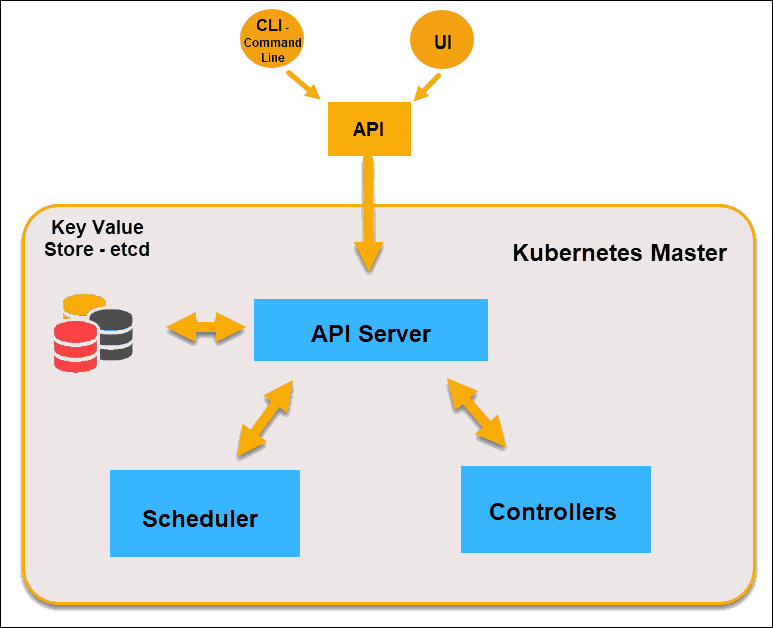
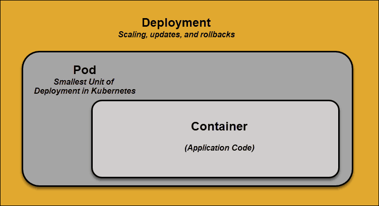
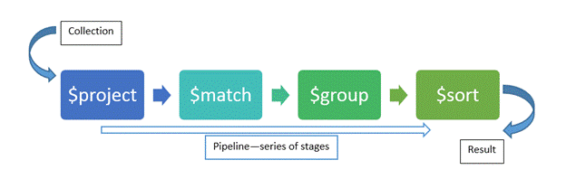

# Home office tasks

Home office
[x] - Done
[-] - not done or could not be completed, blocker etc.

## Dag 19.3.20

- [x] Setup work enviroment
  - [x] Install VurtualBox guest additions
  - [x] Install Centos8 on virtualBox
  - [x] Install TMUX
  - [x] Install minoconda
  - [x] Install Minikube (single-node Kubernetes) <https://kubernetes.io/docs/tasks/tools/install-kubectl/>
        - [x] None-empty `grep -E --color 'vmx|svm' /proc/cpuinfo`
            - [x] Enable Nested VT-x/AMD-V VB manager
    - [x] Install Kubernetes <https://phoenixnap.com/kb/how-to-install-kubernetes-on-centos>
      - [x] Install kubectl
    - [x] Setup SSH key on github
    - [x] Setup postman  <https://tutorialforlinux.com/2019/09/26/how-to-install-postman-on-centos-8-easy-guide/2/>
    - [x] Fix not enough space on root disk (16 G too small!)
      - [x] Install gparted `sudo dnf install gparted`
      - [x] Extend partition in VirtualBox
      - [x] Extend partiton table with 16.23 GiB more
        - `lvextend -L +16.23GiB /dev/mapper/cl-root`
        - `partprobe`
        - `xfs_growfs /`mm
- [x] Setup conda enviroment "kubec"  
`conta create -n kubec python=3.6 pip`  
`source activate kubec`  
`source deactivate`  
  - [x] Install Python v3.6
  - [x] Install Flask
  - [x] Install pymongo
  - [x] Install redis
  - [x] Install python-dateutil: <https://pypi.org/project/python-dateutil/>
  - [-] Install Hamcrest
- [x] Install Vscode
  - [x] Python extension
  - [x] Yaml extension
- [x] Follow Tutorial to learn basics of Kubernetes

## Dag 20.3.20

- [x] Kubernetes architecture overview: <https://www.youtube.com/watch?v=8C_SCDbUJTg>
- [x] Follow Basic Tutorial: <https://api.mongodb.com/python/current/tutorial.html>
- [x] Setup Mongodb client
  - [x] Install mongodb: <https://docs.mongodb.com/manual/tutorial/install-mongodb-on-red-hat/>

```repo
cat >/etc/yum.repos.d/mongodb-org-4.2.repo <<EOL
[mongodb-org-4.2]
name=MongoDB Repository
baseurl=https://repo.mongodb.org/yum/redhat/$releasever/mongodb-org/development/x86_64/
gpgcheck=1
enabled=1
gpgkey=https://www.mongodb.org/static/pgp/server-4.2.asc
EOL
```

- [x] Aggregate in Mongodb: <https://medium.com/@paulrohan/aggregation-in-mongodb-8195c8624337>
- [x] Aggregation Mongod: <https://docs.mongodb.com/manual/aggregation/>

## Dag 23.3.20

- [x] Aggregate in Mongodb: <https://medium.com/@paulrohan/aggregation-in-mongodb-8195c8624337>
- [x] Mongo Aggregations in 5 Minutes: <https://engineering.universe.com/mongo-aggregations-in-5-minutes-b8e1d9c274bb>
- [x] Chanter 4: Quering: <https://www.oreilly.com/library/view/mongodb-the-definitive/9781449344795/ch04.html>

## Dag 24.3.20

- [x] (Corrupted virtual machine image first time, try to advoid?)Installing Podman-docker <https://thenewstack.io/check-out-podman-red-hats-daemon-less-docker-alternative/>
    `sudo dnf install @container-tools`
- [x] Install podman <https://podman.io/getting-started/installation>
- [x] Basic Setup and Use of podman <https://podman.io/getting-started/>

```cmd
podman run -dt -p 8080:8080/tcp -e HTTPD_VAR_RUN=/var/run/httpd -e HTTPD_MAIN_CONF_D_PATH=/etc/httpd/conf.d \
                  -e HTTPD_MAIN_CONF_PATH=/etc/httpd/conf \
                  -e HTTPD_CONTAINER_SCRIPTS_PATH=/usr/share/container-scripts/httpd/ \
                  registry.fedoraproject.org/f29/httpd /usr/bin/run-httpd
```

- [-] Multi-container pods and pod communication <https://www.mirantis.com/blog/multi-container-pods-and-container-communication-in-kubernetes/>
- [x] Configure pod initialization <https://kubernetes.io/docs/tasks/configure-pod-container/configure-pod-initialization/>
- [x] Proxy access to kubernets api <https://kubernetes.io/docs/tasks/access-kubernetes-api/http-proxy-access-api/>

- [-] Snapshot of current build
- [x] Git push changes before shutdown.

## Dag 25.03.20

- [x] Connecting Applications with Services <https://kubernetes.io/docs/concepts/services-networking/connect-applications-service/>

    ```bash
        # Create a public private key pair
        openssl req -x509 -nodes -days 365 -newkey rsa:2048 -keyout /keys/nginx.key -out /keys/nginx.crt -subj "/CN=my-nginx/O=my-nginx"
        # Convert the keys to base64 encoding
        cat /d/tmp/nginx.crt | base64
        cat /d/tmp/nginx.key | base64
    ```

    1. `kubectl create configmap nginxconfigmap --from-file=default.conf`
        1. `mdir /etc/nginx/ssl | cp keys/* /etc/nginx/ssl/`
    2. `kubectl apply -f nginxsecrets.yaml`: nginxsecret
    3. `kubectl delete deployments,svc my-nginx; kubectl create -f ./nginx-secure-app.yaml`: Delete deployments and services with name 'my-nginx'.
        - Volume mapping to other resource (Not local files)
    4. `kubectl get pods -l run=my-nginx -o yaml | grep -i podip` IP-pod
    5. `kubectl apply -f curlpod.yaml`
    6. `kubectl exec -it curl-deployment-<rest> -- bin/sh`
        1. `curl -k https://IP-pod`
    7. LoadBalancer not availible in Minikube.  
  - [x] Install go <https://computingforgeeks.com/how-to-install-go-on-rhel-8/>
  - [x] Corrupt GIT data <https://stackoverflow.com/questions/4254389/git-corrupt-loose-object/13918515#13918515?newreg=7082361fbc474a77b63e977aa8a80ff0>
- [x] xclip <https://computingforgeeks.com/how-to-copy-and-paste-text-in-a-linux-terminal/>
- [*] Setup kubernetes cluster
- [x] Container images <https://blog.giantswarm.io/building-container-images-with-podman-and-buildah/>
  - Podman use Dockerfiles to build images, or can use buildah syntax when Dockerfile is too restrictive (i.e. script-like approach).
- [x] Git push changes before shutdown.

## Dag 26.03.20

- [x] VBox snapshot
- [x] Style bash PS1 <https://www.cyberciti.biz/faq/bash-shell-change-the-color-of-my-shell-prompt-under-linux-or-unix/>
- [-] Services <https://kubernetes.io/docs/concepts/services-networking/service/>
- [x] Ingress <https://kubernetes.io/docs/tasks/access-application-cluster/ingress-minikube/>
  - `minikube addons enable ingress` No ADDRESS if not enabled
    - Verify with `kubectl get pods -n kube-system` give nginx-ingress-controller.
    - Add Ingress IP to /etc/hosts, `IP host-name`
- [x] Enable kubectl autocompletion <https://kubernetes.io/docs/tasks/tools/install-kubectl/>
  - as root user: `kubectl completion bash >/etc/bash_completion.d/kubectl`
- [x] Flask-vue-kubernetes <https://testdriven.io/blog/running-flask-on-kubernetes/>
- [x] Git push changes before shutdown.
- [x] Snapshot.

## Dag 27.03.20

- [x] Persistent Volume / Persisten Volume Claim
- [x] Stateful applications blog <https://kubernetes.io/blog/2016/12/statefulset-run-scale-stateful-applications-in-kubernetes/>
- [x] Deployment vs statefulsett vs deamonsets <https://medium.com/stakater/k8s-deployments-vs-statefulsets-vs-daemonsets-60582f0c62d4>
- [-] Standalone Mongodb on Kube <https://medium.com/@dilipkumar/standalone-mongodb-on-kubernetes-cluster-19e7b5896b27>
- [-] Running MongoDB on Kubernetes with StatefulSets <https://kubernetes.io/blog/2017/01/running-mongodb-on-kubernetes-with-statefulsets/>
- [-] <https://leadwithoutatitle.wordpress.com/2018/03/05/how-to-deploy-mongodb-with-persistent-volume-in-kubernetes/>

- [x] Git push changes before shutdown.

## Dag 30.03.20

- [x] minikube mongodb demo <https://github.com/pkdone/minikube-mongodb-demo>
  - `db.getSiblingDB('admin').auth("main_admin", "abc123");`
  - `db.setSlaveOk();` Set Secondary as Slaves to Primary.
- [x] Fortsette med deployment av Mongodb.
- [x] Sette opp Mongo container.
- [-] <https://kubernetes.io/docs/tutorials/stateful-application/basic-stateful-set/#pods-in-a-statefulset>
  - `Pods in a StatefulSet have a unique ordinal index and a stable network identity.`
  -`<StatefulSet>-<Ordinal>.<Service>`
- [-] <https://kubernetes.io/blog/2017/01/running-mongodb-on-kubernetes-with-statefulsets/>
  - `mongodb://mongo-0.mongo,mongo-1.mongo,mongo-2.mongo:27017/dbname\_?`

## Dag 31.03.20

- Standup : Scalering av mongodb, hvordan sende queries fra andre poder. Lese litt på Helm.
- [x] <https://kubernetes.io/docs/tasks/run-application/run-replicated-stateful-application/>
- [x] <https://kubernetes.io/blog/2017/01/running-mongodb-on-kubernetes-with-statefulsets/>
- [x] <https://docs.mongodb.com/manual/replication/>
  - `kubectl drain m01 --force --delete-local-data --ignore-daemonsets`
  - `kubectl uncordon m01`
- [-] How to send traffic to Mongodb, and queries...

## Dag 01.04.20

- Standup: Fortsette med det jeg drev med i går. Node drain. Hente kode fra Håvard, og bytte ut databasen.
- [x] Fatal: Git index smaller than expected: <https://stackoverflow.com/questions/4254389/git-corrupt-loose-object/13918515#13918515?newreg=7082361fbc474a77b63e977aa8a80ff0>
- [x] mondb-replication <https://maruftuhin.com/blog/mongodb-replica-set-on-kubernetes/>
- [x] <https://medium.com/faun/scaling-mongodb-on-kubernetes-32e446c16b82>
- [x] dnslookup pod <https://kubernetes.io/docs/tasks/administer-cluster/dns-debugging-resolution/>

## Dag 02.04.20

- [x] Koble opp db med repo <https://github.ibm.com/gbs-norway-tech-community/vue-flask-mongo-kubernetes>
  - Building repos
  - `podman build -t flask-backend .`
  - `su root` too many files in vue-frontend for default users.
  - `podman build -t vue-frontend .`
    - [x] create repo
      `https://hub.docker.com/repository/docker/sondreweb/vue-frontent`
    - [x] push image to repo
      - [x] `podman login --username sondreweb docker.io`, paste key from docker.io as password.
      - `podman push localhost/vue-frontend sondreweb/vue-frontend:latest`
  - `minikube podman-env`
  - `eval $(minikube -p minikube podman-env)` Use podman for images
  
- [x] Helm <https://www.youtube.com/watch?v=fy8SHvNZGeE>
- [x] Install helm <https://www.digitalocean.com/community/tutorials/how-to-install-software-on-kubernetes-clusters-with-the-helm-package-manager>
- [-] Blocker! <https://github.com/kubernetes/minikube/issues/6350>
  - [-] Mitigate by uploading images to docker.io instead and point to public repo imags.
    - As root user (podman cannot build all images unless root, file size/security issues):

```s
  podman login --username <username> docker.io # key from docker.io as password.
  podman build -t <image-tag?> <location>
  podman push localhost/<image-tag> <username>/<image-repo>[:]<optional-version-tag>
  # set image tag in yaml to repo image to use.
  image: <username>/<image-repo>[:]<optional-version-tag>
  # Rebuild kubernetes kind
```

## Day 03.04.20

- [x] Koble opp db med repo <https://github.ibm.com/gbs-norway-tech-community/vue-flask-mongo-kubernetes>
  - Sette begge docker images til public på docker hub.
  - Enviroment varlaibles `/# printenv` in shell of container.
  - Reaching primary mongodb <https://github.com/helm/charts/issues/1569>
  - `db.getSiblingDB("mongo"); use mongo; db.post.find()` i master
  - `db.getSiblingDB("mongo"); use mongo; db.setSlaveOk();db.post.find()`
  
- [-] Setup statefull database and write using master node and read using slaves.
  - [] Fix loadbalander not selecting only master on write operations.
- [-] Helm init
  - [x] Install Helm and Tiller <https://www.digitalocean.com/community/tutorials/how-to-install-software-on-kubernetes-clusters-with-the-helm-2-package-manager>

## Day 06.04.20

- [] Helm
- [] Helm charts

### Backlog

- [ ] Setup feature flags on kubernetes  
- [ ] Setup feature flags on flask  
- [ ] Setup Flask Backend  
- [ ] Setup Flask Frontend  
- [ ] Setup Redis with mongodb  
- [ ] Connect Backend with Frontend  
- [ ] Setup keycloak.
- [ ] Prometheus monitoring Kubernetes. <https://sysdig.com/blog/kubernetes-monitoring-prometheus/>
- [ ] Feature toggling.
- [ ] Feature gates <https://kubernetes.io/docs/reference/command-line-tools-reference/feature-gates/>
- [ ] K9 Kubectl improved?
- [ ] Kubernetes Vaults <https://testdriven.io/blog/managing-secrets-with-vault-and-consul/>
- [ ] grafana <https://medium.com/faun/kubernetes-multi-cluster-monitoring-using-prometheus-and-thanos-7549a9b0d0ae>
- [ ] Sikkere mongodb replicaset <http://pauldone.blogspot.com/2017/06/deploying-mongodb-on-kubernetes-gke25.html>
- [ ] Zookeper?

## Helm

### Tiller

Service component of helm. Takes command sent to cli client and turn them into something the kubernetes kluster will understand.

`heml install myapp` Deploy application to kubernetes with helm config
`heml upgrade mypp` Update application on kubernetes with upgrade helm config.
`helm rollback version...` Rollback to previous configuration history.
`helm package` to semd helm chart to repo, to make reusability easier.

### Kubernetes Architecture

<https://phoenixnap.com/kb/understanding-kubernetes-architecture-diagrams>


#### Deployments

An Api object that manages a replicated application.  
Provides declarative updates for Pods and ReplicateSets(replica set of pods)

#### Ingress

Ingress exposes HTTP and HTTPS routes from outside the cluster to services within the cluster. Traffic routing is controlled by rules defined on the Ingress resource.

```none
    internet
        |
  [ Ingress ]
  --|-----|--
  [ Services ]
```

#### Steps in a basic Kubernetes process

1. An administrator creates and places the desired state of an application into a mnanifest file (yml).
2. The file provided to the Kubernetes API Server using a CLI or UI. Kubernetes command-line tool called __kubectl__
3. Kubernetes stores the file (an application's desired state) in a database called the __Key-Value Store (etcd)__.
4. Kubernetes then implements the desired state on all relevant applications within the cluster.
5. Kubernetes continuously monitors the elements of cluster to make sure the current state of the application does not vary from the desired state.

#### Master Node



- Recives input from a CLI or UI via an API.
- Define pods, replica sets, and services that you want Kubernetes to maintain.
- Provide the parameters of the desired state for the application(s) runnin in that cluster.

##### API server

The front-end of the control plane and the only component in the control plane that we interact with directly.  
Internal system components, as well as external user components, all communicate via the same API.

##### Key-value Store (etcd)

The database Kubernetes uses to back-up all cluster data. It stores the entire configuration and state of the cluster.  
The master node queries __etcd__ to retrieve parameters for the sate of the nodes, pods and containers.

##### Controller

Role: Obtain the desired state from the API Server. Checks the current state of the nodes it is tasked to control, and determines if there are any differences, and resolves them, if any.  

##### Scheduler

Watches for new requests coming from the API server and assings them to healty nodes.  
Ranks the quality of the nodes and deploys pods to the best-suited node. If there are no suitable nodes, the pods are put in a pending state until such a node appears.

#### Worked Node

Listen to the API server for new work assignments.  
They execute the work assignments and then report the results back to the Kubernetes Master node.

##### Kubelet

Runs on every node in the cluster. It is the principal Kubernetes agent, by installing kubelet, the node's CPU, RAM, and storage become part of the broader cluster.  
It watches for tasks sent from the API Server, executes the task, and reports back to the Master.  
Monitors pods and reports back to the control panel if a pod is not fully functional.  
Based in this information, the Master can then decide how to allocate tasks and resources to reach the desired state.

##### Container Runtime

Pulls images from a __container image registry__ and starts and stops containers.  
A 3rd party software or plugin, such as Docker, usually performs this function.

##### Kube-proxy

Makes sure that each node gets its IP adress, implements local _iptables_  and rules to handle routing and traffic load-balancing.  

##### Pod



Smalles element of scheduling in Kubernetes. Without it, a container cannot be part of a cluster.  
The pods serves as a 'wrapper' for a single container with the application code. Based on the availability of the resources, the Master schedules the pod on a specific node and coordinates with the container runtime to launch the container.  

If pods unexpectedly fail to perform their tasks, Kubernetes creates and starts a new pod in its place. The pod is a replica, expect for the DNS and IP address.  

Pods need to be desidned so that an entirely new pod, created anywhere within the cluster, can seamlessly take its place. __Services__ assist in this process.  

##### Services

__Services__ are introduces to provide reliable networking by bringing stable IP addresses and DNS names to the unstable world of pods.

Pods are associated with services through key-value pairs called __labels__ and __selectors__. A service automatically discovers a new pod with labels that match the selector. This also removes terminated pods from the cluster.

###### Headless Service

Like a normal Kubernetes Service, except it doesn't perform any load balancing.

## Podman

`podman pull images`: First check registry.redhat.io for latest image, then docker.io if not there.  
`podman images`: List images availible.  
`podman rmi ID`: Delete images on ID tag.  
`podman rm ID`: Delete container _'-f'_ to force already running containers.  
`podman inspect ID`:  Inspect '-l' latest running or ID container for metadata.  
`podman logs ID`: View container's logs.  
`podman top ID`: View container's top statuses (CPU %, PID etc).  
`sudo podman container checkpoint ID`: Stop and store state of a container for later use.  
`sudo podman container restore ID`: Restore container at the exact same state as checkpoint.  

## mongodb queries

`db.collection.find({query})`:  
`db.collection.insert_one({})`:  Insert one document into collection.  
`db.collection.insert_many([{}])`: Insert multiple documents at once. (Not one after the other).  
`db.collection.create_index([('user_id', pymongo.ASCENDING)],unique=True)`:  Unique index per document.  

__Operators__ come in three varities: __stages__,__expressions__, and __accumulators__.  

### Aggregastion

A Pipeline.


#### Minikube

`minikube start` : Start cluster  
`minikube dashboard` : Access the Kubernetes Dashboard running within the minikube cluster.  
`minikube ip`: Get Node IP
`minikube stop` : Stop local cluster  
`minikube delete` : Removes a local Kubernetes cluster
`minikube delete --all` : Delete all local clusters and profiles  

Once started: `kubectl`  
`kubectl create deployment hello-minikube --image=k8s.gcr.io/echoserver:1.4` : Start server.  
`kubectl expose deployment hello-minikube --type=NodePort --port=8080` : Exposing a service as a NodePort.  
`minikube service hello-minikube` : Open exposed endpoin in your browser.  
`minikube service <service> --url`: Show URLs of service
`minikube service list`: Show all info of the services in list.

`minikube start -p cluster2` : Start second local cluster (only with bare-metal/none driver).  

`minikube config set memory x` : increase memory beyond just default 2 GB.  

#### Kubectl - Kubernetes command-line tool

`kubectl version`: Display the kubectl version
Allows to run commands against Kubernetes clusters.  
`kubectl cluster-info` : Details of the cluster and its health status  
`kubectl get <kind>`: kinds:{pods, nodes, secrets, deployments, pv}  
`kubectl get po(ds) -A` : See all pod state  
    `-l`: label. `-o`: output
`kubectl get nodes` : view the nodes in the cluster  
`kubectl get pv` : Get persistent volume  

`kubectl get deployments`: Get availible deploymnents. A Deployment provides declarative updates for Pods and ReplicaSets.  
`kubectl get (svc|services) <name>`: Get services on label name

`kubectl drain <nodename>` : evict all user pods from the node  
`kubectl delete node <nodename>` : delete node from cluster  
`kubectl delete pods <podname>ls`: Delete specific pod. _'-f'_ to force

`kubectl proxy`: Create proxy that forward communications into the cluster-wide, private network, to the Kubernetes API.  
`kubectl config view`: Check the location and credentials that kubectl knows about.  

`kubectl apply -f pod_config.yaml`: Apply config file _--record_ flag to save the kubectl command that is making changes to the resource.

`kubectl describe x`: Show details of a specific resource or group of resources
`kubectl describe node`: Show attributes of node (CPU/RAM usage etc).

`kubectl get secrets`: Get secrets
`kubectl exec -it shell-demo -- /bin/bash`: Get bash shell to running container

Get name of a pod (if only one)
`kubectl get pod -l service=postgres -o jsonpath="{.items[0].metadata.name}"`

CHeck if volume are still attached.
`Kubectl get volumeattachment`

##### Deployment

`kubectl scale deployment <deploymnt> --replicas=x`: Adjusy replica count on deployment.

## Kubernetes

Pods that are running inside Kubernetes are running on a private, isolated network. By default they are visible from other pods and services within the same kubernetes cluster, but not outside that network.  

### DNS lookup

```bash
kubectl apply -f curl-pod.yaml # Create resource from file.
kubectl attack curl -i  # Attatch to running container
root@curl:/ nslookup my-ngnix
```

### Volumes

Storage. Pods access storage by using the claim as a Volume.

__Emptydir__ is an empty directory either in RAM or on disk (SSH/HDD). Not persistent, as data from the _epmtyDir_ is deleted.  

__hostPath__ is a volume that mounts a file or directory from the host node's filesystem into your Pod. Essentially a Non-empty __EmptyDir__.  

__nfs__ is a volume that allows an existing NFS (Network File System) share to be mounted into your Pod. Nfs volues are preserved and can be used my multiple pods.  

#### Provisioning

__PersistentVolume__ refers to static storage.  
__StorageClass__ refers to dynamic storage.  

__Static__ is a number of __PersistentVolumes__, that carry the detail of the real storage which is available for use bh the cluster user. They exist in the Kube API and are availible for consumption.

When none of the static PVs matches a user's PersistentVolumeClaim, the cluster  may try to __dynamically__ provision a volume specially for the PVC, based on _StorageClasses_. The PVC must request a specific class the administrator have created beforehand.

#### PersistentVolumeClaim

__persistentVolumeClaim__ is used to mount a __PersistentVolume__ into a Pod. Will connect to _PersistentVolume_ if __StorageClassName__ is not provided, else go to __StorageClass__. A controller in PVC watches for new PVCs, when it finds match, it will _bind_ them together, _binds_ are exclusive, meaning cannot bind 2 pvc to the same pv. A __StorageClass__ provides a way for administrators to describe the "classes" of storage they offer. __Foundation__ of dynamic provisioning.  

__PersistentVolume__ are a way for users to "claim" durable storage (such as a GCE PersistentDisk or an iSCSI volume) without knowing the details of the particular cloud enviroment.

__PersistentVolumeRecycle__ Rescycle, Delete

__Selecter__ filter out wich PV to use from the PVC.

## Postgres

`\l` List tables
`\c collection` Use collection.
`select * from collection`: Get all data records in collection.

### Cluster

Set of node machines running containerized applications.
